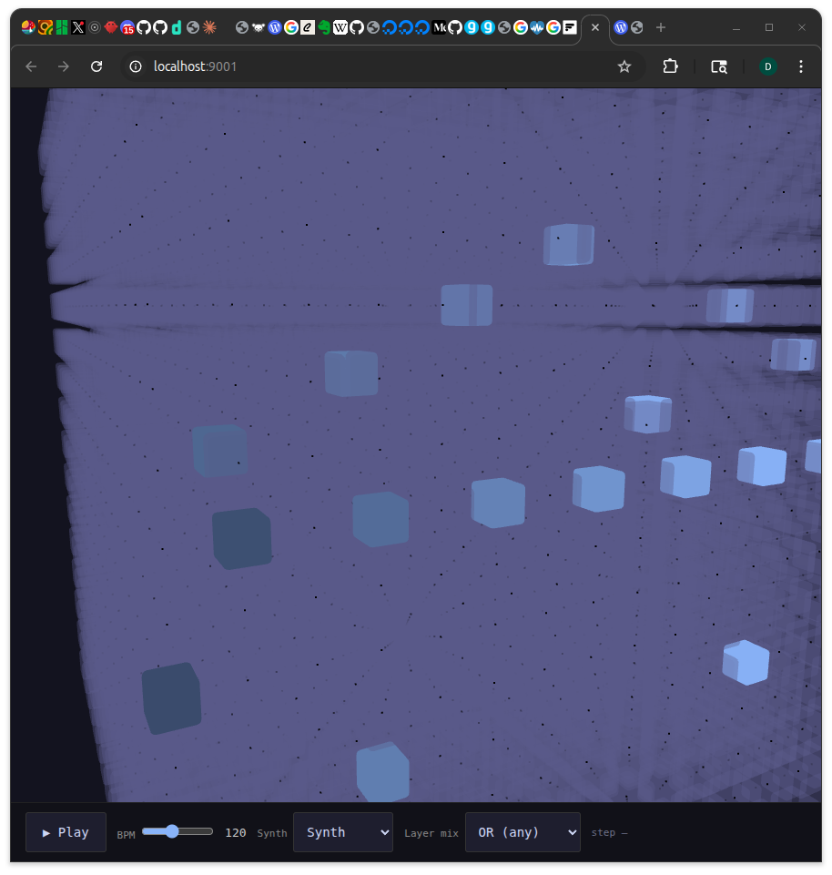

# Near-plane fade: cubes dissolve before they disappear

_2026-03-26_

## What happened

One of the challenges of navigating a 16×16×16 voxel cube is that the front layers block everything behind them as you zoom in. We already had near-plane culling — cubes vanish when their center crosses a plane in front of the camera — but the pop-off was abrupt. One frame there, next frame gone.

Today's change adds a fade zone just beyond the cull threshold. As an active cube enters the zone, its color lerps from blue toward the dark background, melting away rather than snapping off. The effect happens over a configurable depth band (`NEAR_FADE_ZONE = 6` units). Zooming into the cube now feels like moving through space rather than toggling tiles on and off.

## Tweet draft

building a 3D voxel sequencer — the front layers of the cube now fade to black before disappearing as you zoom in, instead of just popping off. makes the space feel like something you're actually moving through. 6 lines of code, one constant to tune.

---

_commit: f7df945 · screenshot: captured (gnome prtsc)_
